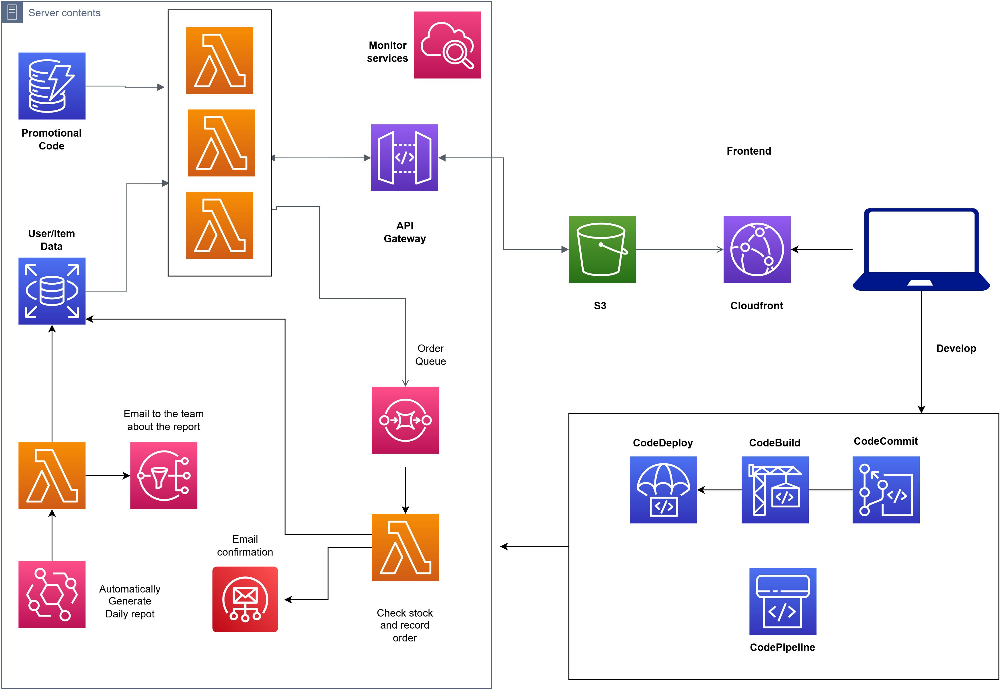

# Serverless Project

## Table of Contents

<ol>
  <li><a href="#about">About</a></li>
  
  <li><a href="#infrastructure">Infrastructure</a></li>
  
  <li><a href="#project-status">Project Status</a></li>
  
  <li><a href="#architecture">Architecture</a></li>
  
  <li><a href="#features">Features</a></li>
  
  <li><a href="#user-interaction-flow">User Interaction Flow</a></li>
  
  <li><a href="#conclusion">Conclusion</a></li>
</ol>

<h2 id="about">About</h2>

This project entails the development of a fully serverless e-commerce platform leveraging AWS microservices. With an emphasis on scalability and efficiency, the system optimally handles user requests and data storage.

<h3 id="built-with">Built With</h3>

- 
- 
- 

<i>The website's frontend is crafted using a template. The primary objective was to emphasize backend development and seamless integration of AWS services rather than intricate frontend design.</i>

<h2 id="infrastructure">Infrastructure</h2>

1. <b>Hosting and Delivery</b>: The static website is hosted on an S3 bucket and served using CloudFront for rapid content delivery.
2. <b>User Request Management</b>: User interactions and requests are adeptly handled via AWS's API Gateway and processed by Lambda functions.
3. <b>Data Storage</b>: User information and product inventory are stored in RDS (using the MySQL database) and DynamoDB, ensuring reliable and efficient data retrieval.
4. <b>Order Notification</b>: Upon an order placement, SES (Simple Email Service) gets triggered, sending an immediate notification to the site admin about the product purchase.
5. <b>Daily Sales Log</b>: SNS (Simple Notification Service) is employed to generate a daily log of sales, ensuring the admin stays updated on the day's transactions.

<h2 id="project-status">Project Status</h2>

This project is currently offline as the account used to set up the project is no longer available. Also, as most AWS services charge the user, the project cannot be indefinitely online.

<h2 id="architecture">Architecture</h2>

<h2 id="features">Features</h2>

|                    | **Feature**                                 |          **Services**         |
|--------------------|---------------------------------------------|:-----------------------------:|
| **Admin Features** | Promo Code                                  | Lambda, DynamoDB              |
|                    | Daily Sales Report                          | Lambda, EventBridge, SNS      |
|                    | Admin Tools (Update, Add, and Delete items) | Lambda, API Gateway           |
|                    | Email Low Stock                             | Lambda, SES                   |
| **User Features    | Cart Persistence                            | -                             |
|                    | View Item Description                       | RDS, Lambda, API Gateway      |
|                    | Purchase History                            | RDS, Lambda, API Gateway      |
|                    | Place Order                                 | SQS, RDS, Lambda, API Gateway |
|                    | Cancel Order                                | RDS, Lambda, API Gateway      |
|                    | User Login / Sign Up                        | DynamoDB, Lambda API Gateway  |
|                    | Order Email Confirmation                    | Lambda, SES                   |
|                    |                                             |                               |
<h2 id="user-interaction-flow">User Interaction Flow</h2>

1. A client sends a request to access the website.
2. CloudFront retrieves and displays the website content.
3. Depending on user or admin actions, Lambda functions are triggered via the API Gateway.
4. In instances of high-volume requests within a short time frame, SQS (Simple Queue Service) steps in as a mediator. It acts as a buffer, ensuring all user requests are appropriately queued and processed without overwhelming the system.
5. Post-purchase, a receipt is dispatched to the user with SES (Simple Email Service). If the item hits the threshold set and is considered "Low Stock" SES will dispatch a second email to the admin to indicate the item is low stock.
6. Lambda functions manage the generation of a daily sales report at the end of the day, keeping the admin informed.

<h2 id="conclusion">Conclusion</h2>

This project adeptly harnesses the potential of AWS microservices, offering a scalable and efficient serverless e-commerce solution. By streamlining user request management, data storage, and notification systems, the platform ensures a seamless shopping experience for users and easy administration for the site owner.
